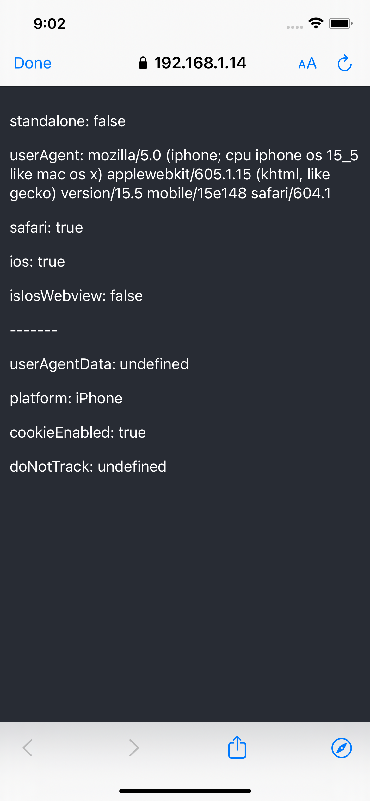

## Mobile Web Views Proof of Concept

Test to see if it's possible to identify if a user is viewing a page inside an app through Expo web browser (spoiler alert - it isn't).

[Expo web browser](https://docs.expo.dev/versions/v46.0.0/sdk/webbrowser/) provides access to the system's web browser and supports handling redirects.

For authentication, it uses [ASWebAuthenticationSession](https://developer.apple.com/documentation/authenticationservices/aswebauthenticationsession) under the hood.

| Auth Session Browser      	| Safari Browser       	| In-app WebView      	|
|---------------------------	|----------------------	|---------------------	|
|            	|       |     	|

### Web

